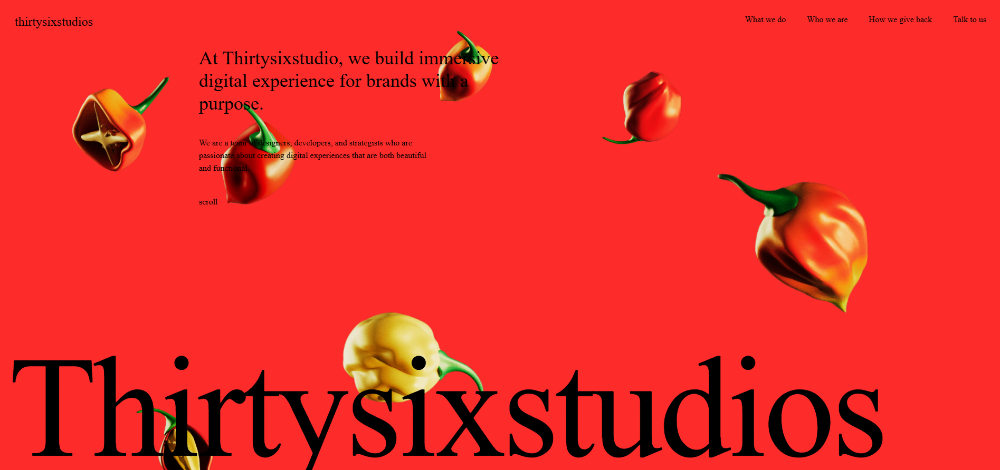

# ThirtySix Studio – Agency Portfolio

This project is a clone of the Thirty Six Studio website, built to practice and improve GSAP animations in a React environment.
The main focus was experimenting with smooth transitions, scroll-based animations, and interactive motion effects using GSAP with React.

This clone is not intended for commercial use—it was created purely for learning, experimentation, and animation practice.
Through this project, I explored animation timing, performance optimization, and how GSAP integrates with modern React components.

---

## 🚀 Live Demo

👉 **Live Site:** 
https://thirtysixstudiosdemo.netlify.app/

---

## ✨ Features

* **Smooth Animations** – Premium animations powered by GSAP and ScrollTrigger
* **Modern UI** – Clean, responsive design using Tailwind CSS
* **Optimized Performance** – Fast loading using React + Vite

---

## 🛠️ Tech Stack

**Frontend**

* React
* Tailwind CSS
* JavaScript
 
**Animations**

* GSAP (GreenSock Animation Platform)
* Framer Motion

**Bundler**

* Vite

**Deployment**

* Vercel

---

## 📸 Screenshots & Videos

